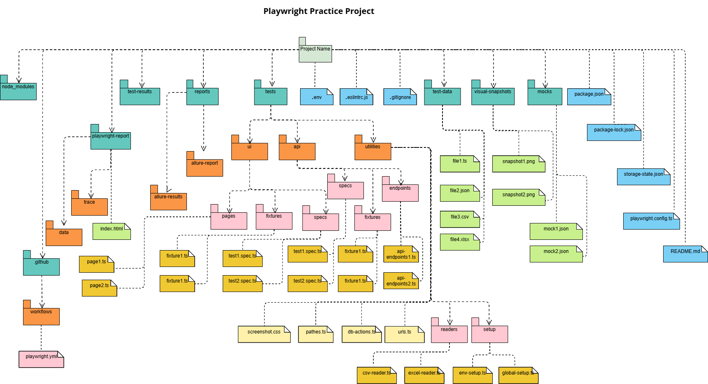

# Playwright Practice Project

*- This project is a practice project  to build a solid test automation framework using playwright test automation tool and typescript programming language.*

*- You can use this framework to be a start point for your test automation project to write your automated test cases.*

*- This project is based on Playwright oficial documentaiton and you can find more detais in the website:*
https://playwright.dev/docs/intro

## `Preparation:`

### A. Pre-requirements:

#### 1- Download and install latest nodejs through the below link
https://nodejs.org/en/download
        
#### 2- Download and install visual studo code throw the below link
https://code.visualstudio.com/download

#### 3- Install VSCode extentions
* Playwright test for VSCode
* ESLint

### B. Project readiness

#### 1- Clone the project

#### 2- Run the below command to install the required dependancies

        npm install

## `Features:`

### A. Usage of Playwright advantages:

#### 1- Waits and timout adjustment
* Total run timeout
* Action timeout
* Expect timeout

#### 2- Screenshots, video recording and trace preparation
* General adjustment across the project
* Special adjustment per browser

#### 3- Different types of reports configurations
* html - json - junit - line - dot

#### 4- Parallel execution and number of workers adjustment
* Number of worker adjustment inside the config file

#### 5- Fixtures
* Grouping pages and general actions related to set of tests
* Adding an example of using fixtures

#### 6- Global Setup
* Preserving cookies to avoid repeating login actions
* Adding the pre required actions of the test run

#### 7- API tests
* Adding usable API URLs
* Applying api tests with different methods using simple examples

#### 8- Visual test
* Applying visual tests in different pages using simple examples

#### 9- Tests examples
* Simple examples of test cases scripts using some options like "annotations, filteration, ..."

### B. Extra features:

#### 1- Page Object Model design pattern
* Separating pages contents in different modules to enhance readability and maintainability

#### 1- Project structure adjustment to modules
* Dividing the project into modules according to its functionality and usage

#### 2- Using data driven framework
* Separating test data to external files to enhance readability and maintainability
* Reading from different types of files (json format and ts files)
## `Features:`

### A. Usage of Playwright advantages:

#### 1- Waits and timout adjustment
* Total run timeout
* Action timeout
* Expect timeout

#### 2- Screenshots, video recording and trace preparation
* General adjustment across the project
* Special adjustment per browser

#### 3- Different types of reports configurations
* html - json - junit - line - dot
* integration with Report Portal

#### 4- Parallel execution and number of workers adjustment
* Number of worker adjustment inside the config file

#### 5- Fixtures
* Grouping pages and general actions related to set of tests
* Adding an example of using fixtures

#### 6- Global Setup
* Preserving cookies to avoid repeating login actions
* Adding the pre required actions of the test run

#### 7- API tests
* Adding usable API URLs
* Applying api tests with different methods using simple examples

#### 8- Visual test
* Applying visual tests in different pages using simple examples

#### 9- Tests examples
* Simple examples of test cases scripts using some options like "annotations, filteration, ..."

### B. Extra features:

#### 1- Page Object Model design pattern
* Separating pages contents in different modules to enhance readability and maintainability

#### 2- Project structure adjustment to modules
* Dividing the project into modules according to its functionality and usage

#### 3- Using data driven framework
* Separating test data to external files to enhance readability and maintainability
* Reading from different types of files (json format, csv and excel sheets)

#### 4- Running in different environments
* Adding an option to pass the environemnt value through CLI
* Adjustment of the baseURL in code and config file according to the running environment
* Adjustment of different data files according to the running environment

#### 5- Handling different languages
* Adding a simple technique to run the test cases in different language
* Adding an option to pass the language through CLI

#### 6- Allure report
* Adding allure report with more alnaytics and charts options to enhance readability and visibility to the test report
* Adjusting the report to attach (screenshots, videos, trace and console logs)

#### 7- Eslint tool for static analysis
* Adding the eslint dependency for static analysis for typescript code
* Adding .eslintc.js config file to adjust its rules

## `Contents:`

### A. Folders and directories:

#### 1- tests/ui/specs/:
* All frontend test cases scripts

#### 2- tests/api/specs/:
* All API test cases scripts

#### 3- tests/ui/pages/:
* All frontend pages

#### 4- tests/api/endpoints/:
* General used endpoints requests, request bodies, params and headers for APIs

#### 5- tests/ui/fixtures/:
* All used frontend fixtures according to test groups

#### 6- test-data/:
* All test data files with different types (json format and ts files)

#### 7- visual-snapshots/:
* The folder that contains the visual snapshots that are captured during the run to be the visual basline images

#### 8- tests/utilities/setup/:
* globalSetup.ts: for Global Setup method implementation
* envSetup.ts: for adjusting the data needed for every environment (test, preprod and production)

#### 9- tests/utilities/:
* urls.ts: base URL for every environment
* screenshot.css: visual testing configuration for dynamic pages

#### 10- playwright-report/:
* Playwright default reports (html, line, dot, json, junit, ...)
* Report Portal integration

#### 11- test-results/:
* All results of test cases runs (screenshots, vidos, trace, ...)

#### 12- node_modules/:
* All downloaded libraries and modules

### B. Project configuration files:

#### 1- playwright.config.ts, test.config.ts, staging.config.ts: 
* The default generated file is "playwright.config.ts"
* Waits, browsers, fully parallel, reporters, default number of worksers, ...
* General configurations across the project

#### 2- package.json:
* Project properities
* Scripts and keywords
* Installed dependencies

#### 3- package-lock.json:
* Detailed Installed dependencies

#### 4- .gitignore:
* All files and folders that needs to be excluded from pushing to the version control

#### 5- .env:
* Environment variables
* Secrets

#### 6- storageState:
* To save login cookies and optimizing authentication

#### 7- .github/workflows/playwright.yml:
* Configurations and commands for installing playwright and running tests in github actions pipeline

#### 8- .eslintrc.config.ts:
* Configurations and rules for code static analysis

## `How to run?`

### A. Running normal test cases:

#### 1- Use direct command as below:

        npx playwright test

#### 2- Show the report:

        npx playwright show-report

#### 3- To pass the used environment you can use the below bash command:

        ENV=test npx playwright test

### B. Running test cases using a pre-defined script in package.json:

        npm run {predefined command}

### C. Generating/ Openning Allure report:

#### 1- Generate the report:

        npx allure generate {report path} -o {generation path} --clean

#### 2- Open the report:

        npx allure open {generated report path}

### D. Using Eslint to make static analysis:

#### 1- Run Eslint command:

        npx eslint {file path}

## `Project Structure:`
*The below is a package diagram for the implemented project structure "Files and folders"*

## `General instructions and guidelines:`

* Specify files and tags that should be run according to bussiness group and testing needs

* Configure package.json file for frequently used commands

* Configure .env file for test environment, secrets and used lanugage

* Every test should have its representative name

* Pages should hold locators, strings, actions and assertions

* Assertions uses playwright validations and assertion module

* It is recommended to collect cases under descripe group

* Files and folders should be named with this formate {firstWord-SecondWord..}

* Variables and methods should start with small letters

* Write locators, scenario steps and tests in the order of the page under test

* Do not assert on existence of a certain element if we will assert on its text

* Do not write any functions if you will not use it

* For every api we create tests in spec file and general used bodies, headers and params under endpoints directory